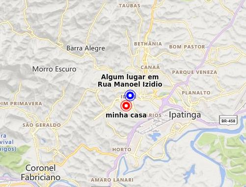

# Bing maps com React



## Instruções

- rodar npm install

- iniciar a aplicação com npm start

- A biblioteca utilizada é react-bingmaps

- A prop bingmapKey recebe o valor da chave de api que foi usada também na API para obter coordenadas de um endereço

- para inserir pontos no mapa basta passar um array de objetos na prop "pushPins" com a seguinte estrutura:

```javascript
[
  {
    location: [-19.46929065, -42.5661732], // coordenadas do marcador
    option: { color: "blue", title: "Algum lugar em Rua Manoel Izidio" }, // cor do marcador
    addHandler: { type: "click", callback: () => alert("cliquei num pushpin") },
  },
];
```

- depois de criado a Key copie a key e utilize-a no seu código
